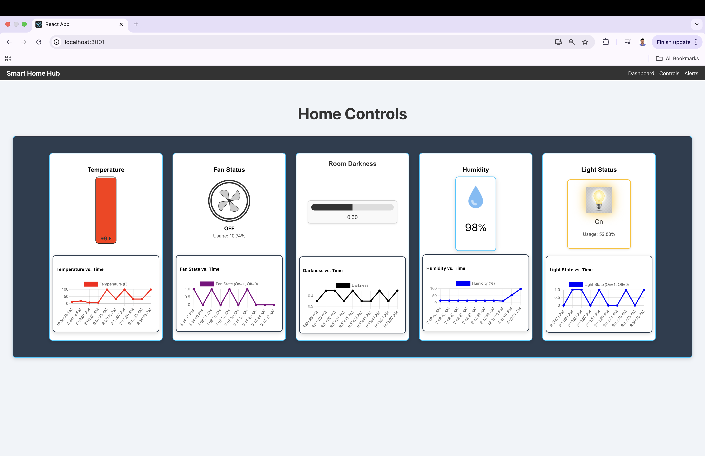
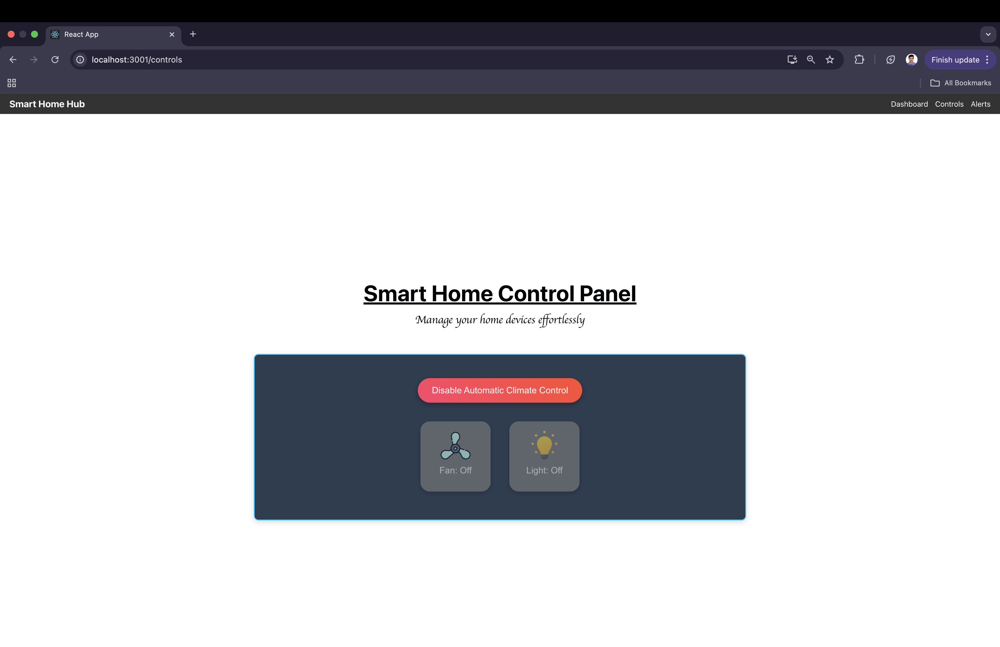
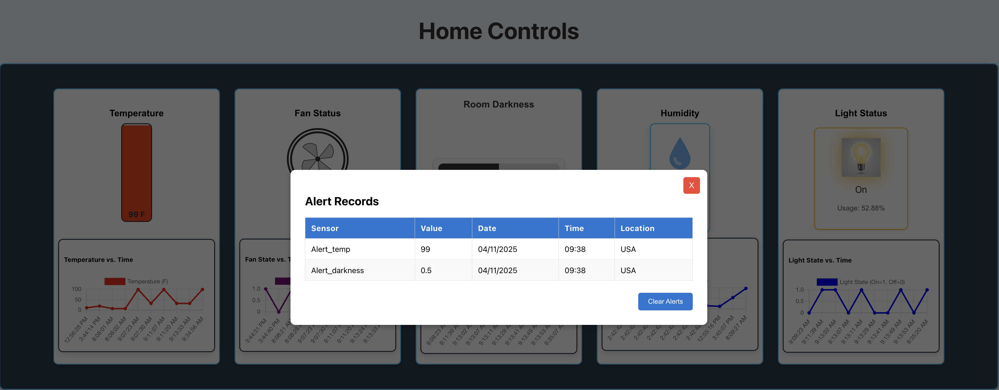
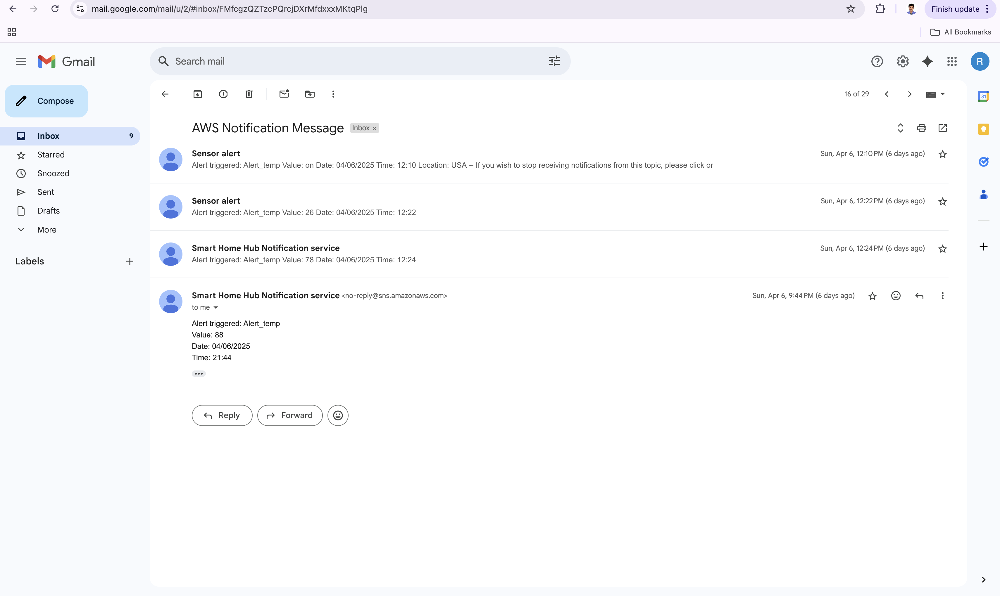

# Team 11 - Smart Home Web Application:

## Table of Contents

1. [Environment Settings](#environment-settings)
2. [How to run the code](#how-to-run-the-code)
3. [How to interpret the results](#how-to-interpret-the-results)
4. [Any sample input and output files(Topics)](#any-sample-input-and-output-filestopics)
5. [Any other information required to run and understand the code](#any-other-information-required-to-run-and-understand-the-code)
6. [Raspberry pi A and sensors](#raspberry-pi-A-and-sensors)
7. [RPi_B_Control.py File](#rpibcontrolpy-file)


---
## Environment Settings
We have server.js(inside Smart-Home-Hub) which serves as a backend server for our project. Before running this you need to run configure the .env file with the relvant details as below.

- **Port:** Port on which your server should. Please provide 3000 
- `Mqtt-Host`: AWS IoT endpoint. (ex as shown in posted .env file)
- `Mqtt-Port`: The MQTT port (8883 mostly )
- `Mqtt-Client-Id`: client identifier for MQTT connections. (ex as in .env)
- Cert-Path: certs/private.pem.key (please provide your certs)
- Cert-Path2: certs/certificate.pem.crt (please provide your certs)
- Cert-Path3=certs/AmazonRootCA1.pem (please provide your certs)
- `Aws-Reg`: AWS region (mostly us-east-1)
- `Aws-Access-Key`: access key from AWS
- `Aws-Secret-Access-Key`:secret access key
- `Arn`: Provide your sns topic arn number
- `Frontend`: url of the frontend application
- `Location`: Default provide USA for Alert records

## How to run the code

#### Clone the Repository: ####
-  make a folder in your local PC and clone the repo with 

- git clone https://github.com/asvch/IoT_HomeApp.git
- cd IoT_HomeApp

#### Install Backend Dependencies: ####

- npm install

#### Setting Up Environment Variables ####

- Please edit the .env file present inside Smart-Home-Hub according to your needs as mentioned in the above section.

With that backend will be running in the localhost:3000

Now for Frontend. please refer below steps.

#### Build the React Frontend (if applicable) ####
- Open a new terminal and cd into IOT-Frontend.

- Then install node dependencies with npm install

- Start your React app with npm start (This will run your application)

#### Open localhost:3001 endpoint to view the dashboad ####

## How to interpret the results ##

We have three sections in the UI,

- Dashboard: 


   - Shows Temperature which turn blue below 33 F, green below 80 F and red above that. The React features chart to display the recent 10 value for the user to see the trend

   - Fan Status to display when the fan is on or off.

   - Room Darkness will display the direct LDR sensor value along with the trend.

   - Humidity will display the amount of humidity present based on DHT22 sensor.With the trend.

   - Light status shows the status of the led as on or off.


- Controls: 

    

    - This page provides user to turn into manual/automatic modes.
    - When user clicks the orange button it will toggle the topcis,
    status_control- {"status":"automatic/manual"} based on which Raspi B will use the threshold logic turn on/off the fan and lights if the status_control is automatic. If it is in manual then user can control the fan and light with the desired buttons 
    - In manual mode the manual_status_fan- {"status":"on/off"} and manual_status_led- {"status":"on/off"} and this is completely user driven from Web Application 

#### Alerts: ####


    - We have designed alerts to provide user with complete information about which sensor got trigerred,value, at what time, date and location.
    - We also used AWS SNS to send email notifications to user 
    
    - The alerts use the topics as shown below.
    - Alert_temp- {"status":"on/off"}, Alert_darkness- {"status":"on/off"} and Alert_humidity- {"status":"on/off"} all are in json format.

## Any sample input and output files(Topics) ##

    Topics used are: Examples as below
        - sensors/temperature - {"temperature":65.3}
        - sensors/humidity - {"humidity":82.2}
        - sensors/ldr - {"darkness":0.45}
        - status/fan - {"status":"on/off"}
        - status/light - {status":"on/off"}
        - fan_usage_percentage - {"precentage":12.2}
        - light_usage_percentage - {"precentage":15.5}

    Topics used for controls: Examples as below
        - status_control - {"status": "automatic"}
        - manual_status_fan - {"status": "on"}
        - manual_status_light - {"status": "off"}

    Topics used for light: Examples as below
        - Alert_temp - {"status":"on"}
        - Alert_humidity - {"status":"off"}
        - Alert_darkness - {"status":"on"}

## Any other information required to run and understand the code ##
#### Tech Stack Used

- **Frontend**: ReactJS
- **Backend**: Express (Node.js)
- **Cloud Environment**:
  - AWS IoT Core
  - AWS Simple Notification Service (SNS)
- **Frontend-Backend Communication**:
  - WebSockets
  - HTTP server clients (GET, POST) with CORS for safety and reliability

#### Dependencies ####

- @testing-library/dom: utilities for testing + interaction with DOM 

- @testing-library/jest-dom: for making readable DOM assertions.

- @testing-library/react: for rendering and testing React components.

- @testing-library/user-event: for realistic user interactions while testing.

- chart.js: React based library for creating customizable charts.

- react: library for building component as single-page applications(SPA).

- react-chartjs-2: React wrapper for Chart.js.

- react-dom: for React components to be rendered and interact with the DOM.

- react-router-dom: for routing and navigation components for React single-page applications(SPA).

- react-scripts: preconfigured scripts that manage building and running your app.

- socket.io-client: for bidirectional communication between client and server.

- web-vitals: to optimize user experience.

- aws-sdk: to interact with AWS.

- dotenv: to load environment variables from .env file 

- express: a light-weighted web framework for Node.js.

- mqtt:a library for connecting and interacting with MQTT brokers.

- simple-statistics: Provides statistical functions and tools for JavaScript.

We have provided comments in sections of code to understand the logic beneath the functionality

## Raspberry pi A and sensors

Relavent code can be executed by

```
python ./sensors/sensors_mqtt.py
```

The following external packages need to be installed:

```
adafruit_ads1x15
adafruit_dht
rpi-lgpio
paho-mqtt
ssl
```

The pin configurations are as follows: 

- ADS1115 ADC module: I2C protocal (SCL&SDA)

- DHT11 Temperature and humidity sensor: GPIO4

- Button: GPIO5 through pull-up resistor

- LED: GPIO6

<h2 id="rpibcontrolpy-file">RPi_B_Control.py File</h2>

To run this code:
1. Create and enter virtual environment: "source kasa-env/bin/activate"
2. Install the following with "python -m pip install ": 
- python-kasa 
- rpi-lgpio 
- paho-mqtt
3. Use "kasa discover" to get the IP addresses of the 2 smart plugs being used, and update the IPs at the top of the code
4. Run "python RPi_B_Control.py" BEFORE starting other RPi_A script

Note: We are using the AWS IoT MQTT broker, so the proper certificate paths and endpoint need to be setup on your end before running. We are also using the SNS service to send emails when in automatic mode when the light or fan have to be turned on due to high temperature or low brightness. 
